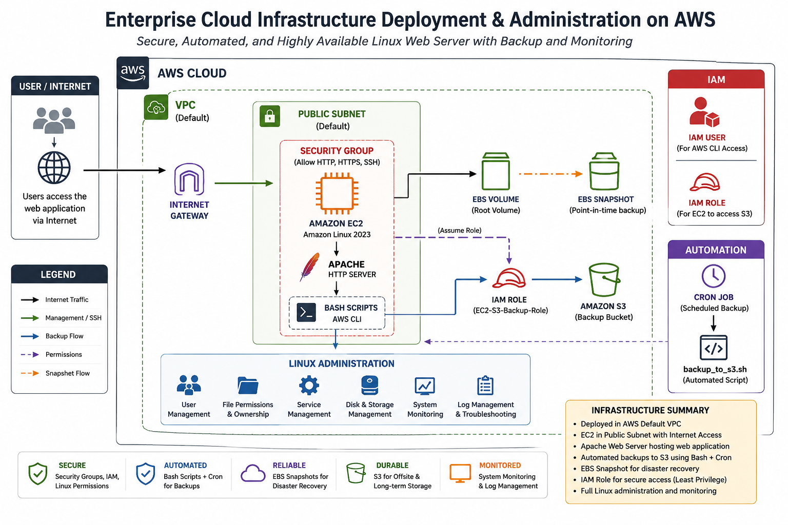
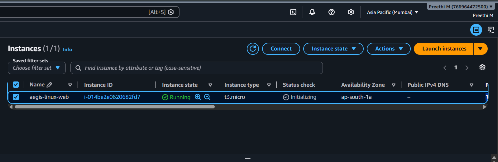
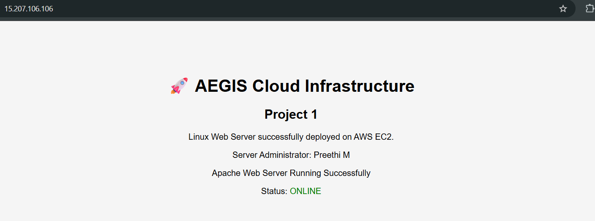
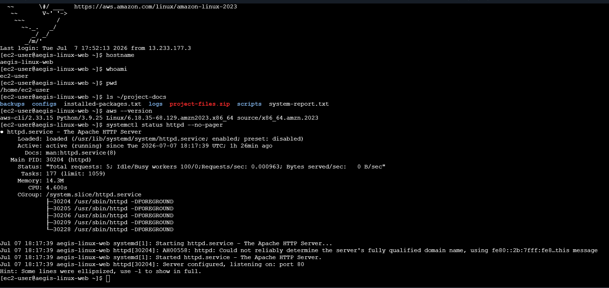
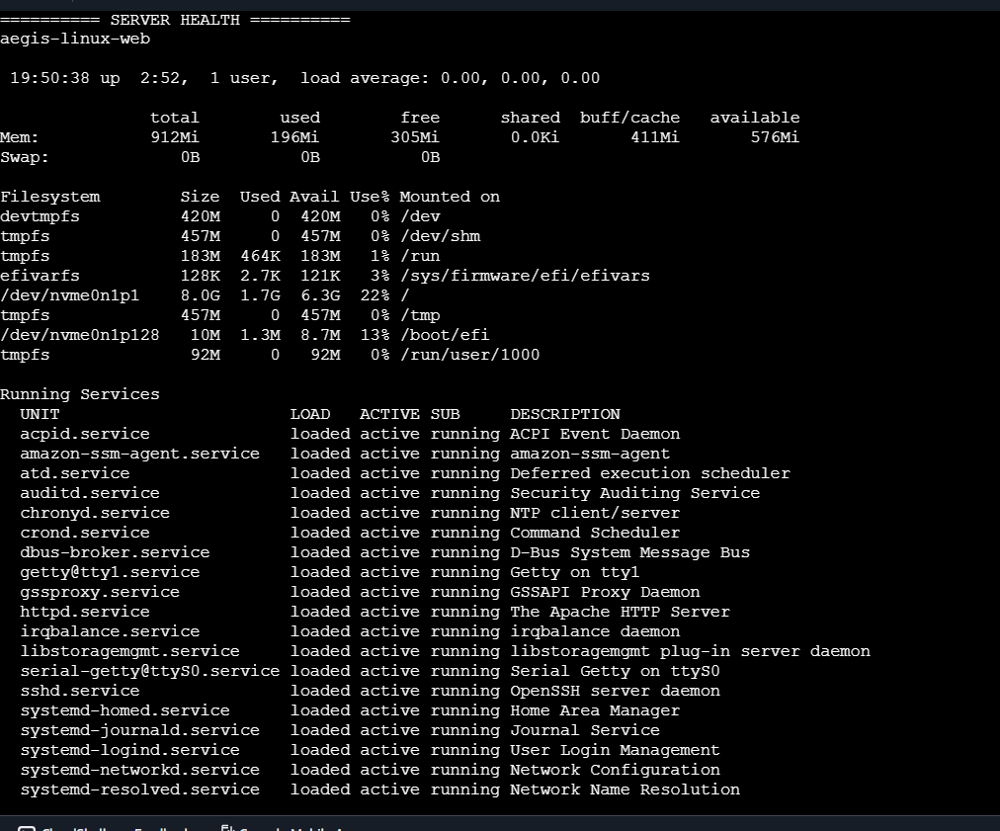
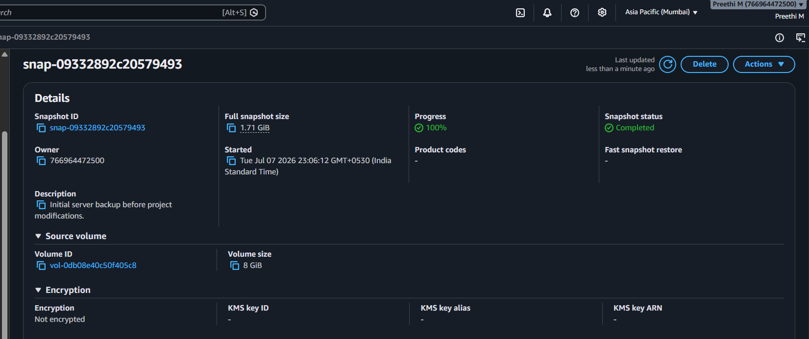
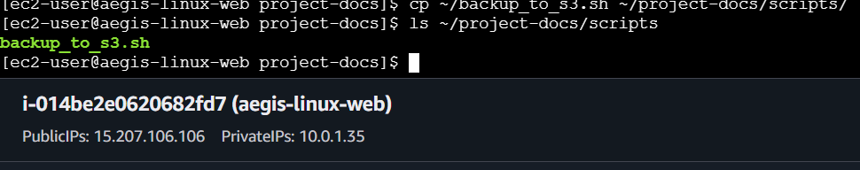
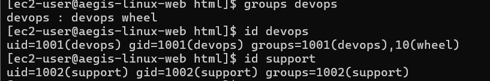
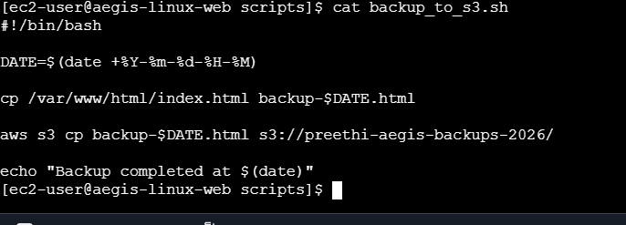

# ☁️ Enterprise Cloud Infrastructure Deployment & Administration on AWS

<div align="center">


**Enterprise-style Linux Infrastructure Deployment, Administration & Automation on Amazon Web Services**

</div>

## 📑 Repository Navigation

| File | Purpose |
|------|---------|
| 📄 **README.md** | Project overview and architecture |
| 📖 **DEPLOYMENT_GUIDE.md** | Complete deployment walkthrough |
| 📂 **documentation/** | Reports and configuration files |
| 💻 **scripts/** | Bash automation scripts |
| 📸 **screenshots/** | Deployment evidence |
| 🎨 **assets/** | Banner, logo, and project graphics |

---
# 📖 Project Overview

This project demonstrates the deployment, administration, security, and automation of a Linux-based web server using Amazon Web Services (AWS). The objective was to gain practical experience with real-world cloud infrastructure tasks typically performed by Infrastructure Engineers, Cloud Support Engineers, and System Administrators.

The infrastructure was deployed on an Amazon EC2 instance running Amazon Linux 2023 within the default AWS networking environment. Apache HTTP Server was configured to host a web application, while Linux administration tasks such as user management, permissions, package management, service administration, monitoring, and automation were performed throughout the project.

To simulate operational workflows, a Bash automation script was developed to generate timestamped backups and upload them securely to Amazon S3 using AWS CLI and an attached IAM Role. Infrastructure recovery was further demonstrated by creating Amazon EBS snapshots.

Unlike a simple tutorial deployment, this repository focuses on documenting the operational aspects of managing cloud infrastructure, including server administration, security practices, automation, backup strategies, troubleshooting, and infrastructure documentation.

## 📘 Documentation

This repository contains the following documentation:

| Document | Description |
|----------|-------------|
| 📄 README.md | Project overview, architecture, implementation details, and screenshots. |
| 📖 DEPLOYMENT_GUIDE.md | Complete step-by-step deployment guide with commands, explanations, expected outputs, troubleshooting, and cleanup instructions. |
| 📂 documentation/ | Configuration files, generated reports, and supporting project documents. |

> **Want to recreate this project?** Follow the **deployment_guide.md** document from start to finish.

---

# 🎯 Project Objectives

The primary goals of this project were to:

- Deploy a Linux web server on Amazon EC2.
- Configure and manage Apache HTTP Server.
- Secure infrastructure using IAM and Security Groups.
- Practice Linux system administration.
- Configure AWS CLI authentication using an IAM Role.
- Automate backup operations with Bash scripting.
- Store backups securely in Amazon S3.
- Create Amazon EBS snapshots for disaster recovery.
- Practice server monitoring and troubleshooting.
- Document the complete deployment process.

---

# 🏗️ Infrastructure Architecture

<div align="center">



</div>

### Infrastructure Summary

The deployed infrastructure consists of:

- Amazon EC2 running Amazon Linux 2023
- Default AWS VPC networking
- Public subnet with Internet access
- Internet Gateway
- Security Group
- IAM User
- IAM Role
- Apache HTTP Server
- Amazon S3 Backup Bucket
- Amazon EBS Volume
- Amazon EBS Snapshot
- AWS CLI
- Bash Automation Script
- Cron Scheduler

---

# 🚀 Key Features

### ☁️ AWS Infrastructure

- Amazon EC2 deployment
- IAM User administration
- IAM Role attachment
- Security Group configuration
- Amazon S3 integration
- Amazon EBS snapshot creation
- AWS CLI configuration

---

### 🐧 Linux Administration

- User management
- Group management
- Administrative privileges
- File ownership
- File permissions
- Package management
- Service management
- Storage inspection
- System monitoring
- Log inspection
- Bash scripting
- Cron scheduling

---

### ⚙️ Automation

- Automated timestamped backups
- AWS CLI integration
- Scheduled Cron execution
- Amazon S3 uploads
- Disaster recovery preparation

---

### 🔒 Security

- Root account protected with MFA
- IAM-based administration
- IAM Role authentication
- Security Group firewall
- Linux privilege separation
- No hardcoded AWS credentials

---

# ☁️ AWS Services Used

| Service | Purpose |
|----------|----------|
| Amazon EC2 | Linux Web Server |
| Amazon Linux 2023 | Operating System |
| IAM | Identity & Access Management |
| Security Groups | Network Firewall |
| Amazon S3 | Backup Storage |
| Amazon EBS | Persistent Storage |
| Amazon EBS Snapshot | Disaster Recovery |
| AWS CLI | AWS Automation |

---

# 📚 Technologies Used

| Category | Technologies |
|-----------|--------------|
| Cloud | Amazon Web Services |
| Operating System | Amazon Linux 2023 |
| Web Server | Apache HTTP Server |
| Scripting | Bash |
| Cloud Automation | AWS CLI |
| Version Control | Git |
| Repository | GitHub |
| Editor | Visual Studio Code |
| Terminal | Windows Terminal & EC2 Instance Connect |

---

# 📂 Repository Structure

```text
Enterprise-Cloud-Infrastructure-Deployment-and-Administration
│
├── README.md
├── LICENSE
├── .gitignore
├── architecture-diagram.png
├── deployment_guide.md
│
├── assets
│  
├── documentation
│   ├── httpd.conf
│   ├── installed-packages.txt
│   └── system-report.txt
│
├── scripts
│   ├── backup_to_s3.sh
│   └── server_health_check.sh
│
└── screenshots
    ├── 01-ec2-instance-running.png
    ├── 02-apache-web-server.png
    ├── 03-ec2-terminal.png
    ├── 04-server-health-script.png
    ├── 05-s3-backups.png
    ├── 06-ebs-snapshot.png
    ├── 07-cron-job.png
    ├── 08-linux-users.png
    └── 09-backup-script.png
```

---

# 📸 Implementation Walkthrough
## 📸 1. Launching the EC2 Instance

The project began by provisioning an Amazon EC2 instance running **Amazon Linux 2023**.

The instance acts as the primary Linux server responsible for hosting the web application and executing administrative tasks.

During deployment:

- Amazon Linux 2023 AMI was selected.
- t3.micro instance type was used.
- SSH access was enabled.
- HTTP traffic was permitted through the Security Group.
- A public IP address was assigned for web access.

### Screenshot



---

## 🌐 2. Configuring Apache HTTP Server

Apache HTTP Server was installed and configured to host a simple web page.

Tasks performed:

- Installed Apache using DNF.
- Started Apache service.
- Enabled Apache to start automatically on boot.
- Verified service status.
- Deployed a custom HTML page.

Apache was verified by accessing the EC2 public IP through a web browser.

### Screenshot



---

## 💻 3. Linux Server Administration

Once the server was operational, several Linux administration tasks were performed to simulate day-to-day infrastructure management.

These included:

- navigating the Linux filesystem
- inspecting directories
- verifying installed packages
- monitoring system resources
- managing services
- viewing disk usage
- checking memory usage

Commands used included:

```bash
hostname
whoami
pwd
ls
free -h
df -h
systemctl
```

### Screenshot



---

## ❤️ 4. Server Health Verification

To verify server health, system resource information was collected using standard Linux administration commands.

The verification included:

- Hostname
- Uptime
- Memory utilization
- Disk utilization
- Running services

This information provides administrators with a quick overview of server status and operational health.

### Screenshot



---

## ☁️ 5. Amazon S3 Backup Storage

A dedicated Amazon S3 bucket was created to store automated backups.

Instead of storing backup files locally, backups were uploaded securely to Amazon S3 using AWS CLI.

This approach provides:

- centralized storage
- durable backup retention
- disaster recovery support

### Screenshot


---

## 💾 6. Amazon EBS Snapshot

An Amazon EBS snapshot was created to capture a point-in-time backup of the server's storage volume.

Snapshots provide infrastructure recovery capabilities and can be used to restore data if required.

### Screenshot



---

## ⏰ 7. Backup Automation using Cron

To simulate routine infrastructure operations, backup automation was scheduled using Cron.

The Cron scheduler allows administrative tasks to execute automatically without manual intervention.

The backup process includes:

- creating a timestamped backup
- uploading it to Amazon S3
- maintaining historical backup copies

### Screenshot



---

## 👥 8. Linux User Administration

Linux users were created to simulate administrative role separation.

Separate user accounts improve security by avoiding unnecessary administrative access.

Tasks completed:

- created users
- assigned administrative privileges
- verified group memberships
- inspected user information

Commands used:

```bash
adduser
usermod
groups
id
```

### Screenshot



---

## 🤖 9. Bash Backup Automation

Infrastructure automation was implemented using a Bash script.

The script performs the following actions:

1. Generates a timestamp.
2. Creates a backup copy of the hosted web page.
3. Uploads the backup to Amazon S3 using AWS CLI.
4. Displays a completion message.

This demonstrates practical automation commonly performed by Infrastructure Engineers.

### Screenshot



---

# 🔒 Security Implementation

Security was considered throughout the project to follow cloud administration best practices.

Implemented controls include:

- Multi-Factor Authentication (MFA) for the AWS root account.
- IAM administrator user for daily administration.
- IAM Role attached to the EC2 instance.
- IAM Role authentication instead of long-term AWS access keys.
- Security Group configured to allow only required inbound traffic.
- Linux privilege separation through multiple user accounts.
- Administrative access restricted using the wheel group.

---

# ⚙️ Backup Automation Workflow

The automated backup process follows the workflow below:

```text
Hosted Web Page
        │
        ▼
Timestamped Backup Created
        │
        ▼
AWS CLI
        │
        ▼
IAM Role Authentication
        │
        ▼
Amazon S3 Bucket
```

The use of IAM Roles removes the need to store AWS credentials directly on the server, improving overall security.

---

# 📈 Skills Demonstrated

This project demonstrates practical experience with:

### AWS

- Amazon EC2
- IAM
- Security Groups
- Amazon S3
- Amazon EBS
- EBS Snapshots
- AWS CLI

### Linux

- User Administration
- Group Administration
- File Permissions
- Apache Administration
- Service Management
- Storage Administration
- Monitoring
- Logging
- Bash Scripting
- Cron

### Infrastructure

- Cloud Deployment
- Backup Strategy
- Disaster Recovery
- Server Administration
- Documentation
- Troubleshooting

---
# 🛠️ Challenges Faced & Solutions

During the implementation of this project, several practical issues were encountered. Resolving these challenges helped strengthen troubleshooting and cloud administration skills.

| Challenge | Solution |
|-----------|----------|
| AWS CLI could not access Amazon S3 | Attached an IAM Role to the EC2 instance instead of using long-term access keys. |
| Apache web page was not accessible | Verified that the Apache service was running and confirmed that HTTP (Port 80) was allowed in the Security Group. |
| Permission errors while managing Linux users | Assigned appropriate administrative privileges using the `wheel` group. |
| Difficulty transferring project files | Used WinSCP with the EC2 SSH private key to securely download project files. |
| Cron job configuration | Configured and verified scheduled execution using `crontab`. |
| AWS Console session interruptions | Reconnected using EC2 Instance Connect and continued administration without affecting the running server. |

---

# 📋 Frequently Used Commands

## Linux Administration

```bash
hostname
whoami
pwd
ls
cd
mkdir
cp
mv
rm
cat
chmod
chown
```

---

## User Management

```bash
sudo adduser devops
sudo adduser support

sudo usermod -aG wheel devops

groups devops
id devops
```

---

## Apache HTTP Server

```bash
sudo dnf install httpd -y

sudo systemctl start httpd

sudo systemctl enable httpd

sudo systemctl status httpd
```

---

## Monitoring

```bash
free -h

df -h

lsblk

uptime

systemctl

journalctl

ss -tuln
```

---

## AWS CLI

```bash
aws --version

aws s3 ls

aws s3 cp

aws sts get-caller-identity
```

---

## Automation

```bash
chmod +x backup_to_s3.sh

crontab -e

crontab -l
```

---

# 🎓 Learning Outcomes

This project provided hands-on experience with both AWS Cloud Infrastructure and Linux System Administration.

Key learning outcomes include:

- Deploying and managing Linux servers on AWS.
- Configuring Apache HTTP Server.
- Understanding IAM Users and IAM Roles.
- Applying Security Group rules.
- Managing Linux users, permissions, and groups.
- Automating administrative tasks using Bash.
- Using AWS CLI to interact with cloud services.
- Implementing backup strategies with Amazon S3.
- Creating Amazon EBS snapshots for recovery.
- Troubleshooting infrastructure and service issues.
- Documenting infrastructure deployments using GitHub.

---

# 🚀 Future Improvements

The following enhancements could be implemented in future versions of this project:

- Configure HTTPS using SSL/TLS certificates.
- Deploy the web application behind an Application Load Balancer (ALB).
- Implement Auto Scaling for high availability.
- Integrate Amazon CloudWatch for monitoring and alerting.
- Provision infrastructure using Terraform.
- Containerize the application using Docker.
- Build a CI/CD pipeline using GitHub Actions.
- Deploy a database using Amazon RDS.
- Configure AWS Systems Manager for remote administration.

---

# 💼 Resume Description

**Enterprise Cloud Infrastructure Deployment & Administration on AWS**

Designed and deployed a Linux-based cloud infrastructure on AWS using Amazon EC2, IAM, Security Groups, Apache HTTP Server, Amazon S3, Amazon EBS, Bash scripting, and AWS CLI. Implemented Linux system administration, automated backup operations using Bash and Cron, configured secure IAM Role-based access, created Amazon EBS snapshots for disaster recovery, and documented the complete deployment using GitHub.

---

# 📚 References

Official AWS Documentation

- https://docs.aws.amazon.com/

Amazon Linux Documentation

- https://docs.aws.amazon.com/linux/

Apache HTTP Server Documentation

- https://httpd.apache.org/docs/

AWS CLI Documentation

- https://docs.aws.amazon.com/cli/

Git Documentation

- https://git-scm.com/doc

---

# 👩‍💻 Author

**Preethi M**

Bachelor of Engineering (Computer Science Engineering - Cyber Security)

GitHub

https://github.com/GitPreethiHub

---

# 📄 License

This project is licensed under the MIT License.

---

# ⭐ Support

If you found this repository useful, consider giving it a ⭐ on GitHub.

---

# 🎯 Conclusion

This project demonstrates practical cloud infrastructure deployment and Linux administration using Amazon Web Services. It combines server provisioning, web hosting, identity and access management, storage, automation, and infrastructure documentation into a single portfolio project that reflects real-world operational workflows.

Rather than focusing only on deploying cloud resources, this project emphasizes day-to-day infrastructure administration, secure operational practices, backup automation, troubleshooting, and documentation. It serves as a strong foundation for more advanced cloud engineering projects involving Infrastructure as Code, containerization, monitoring, and high-availability architectures.